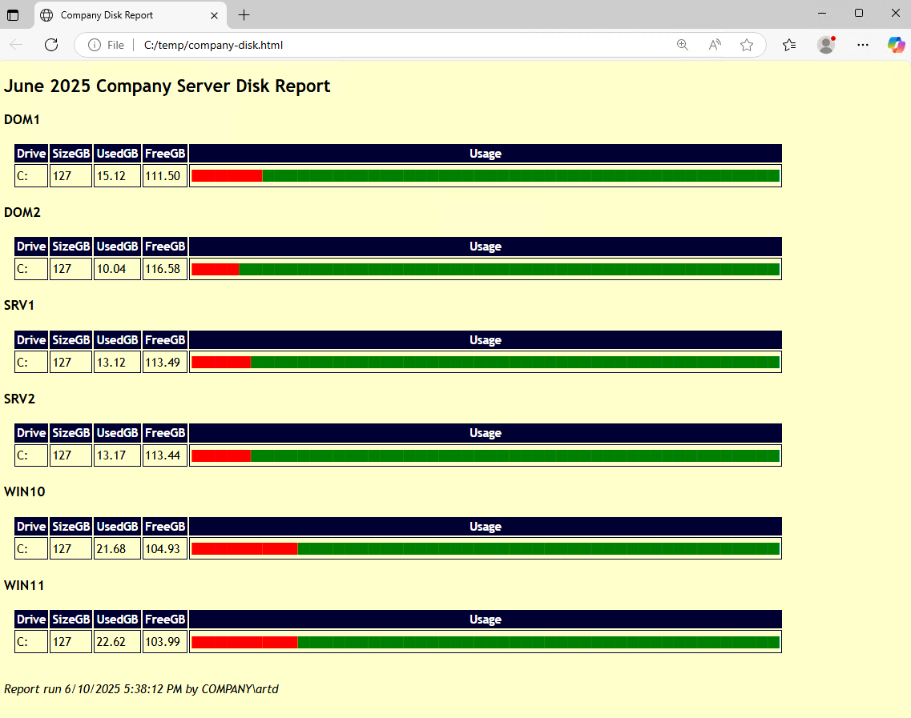
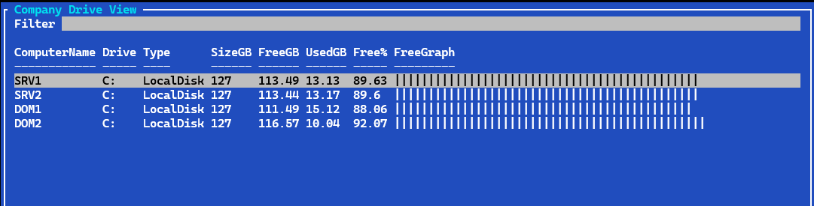
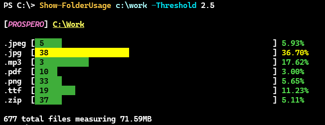
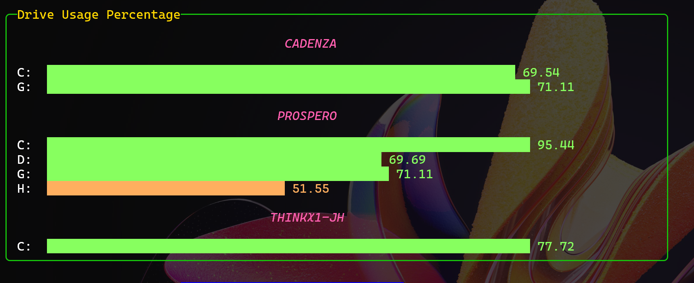

# DiskReportingTools

[](https://www.powershellgallery.com/packages/DiskReportingTools/) [](https://www.powershellgallery.com/packages/DiskReportingTools/)


This PowerShell module contains a few functions you can use to generate reports or gather information about storage devices on your system. The module should work on Windows PowerShell 5.1 and PowerShell 7 on Windows platforms. The commands rely on the CIM cmdlets and traditional PowerShell remoting.

Install the module from the PowerShell Gallery.

```powershell
Install-PSResource DiskReportingTools
```

While you can use the commands in production, they might be equally valuable as models for your own PowerShell scripting.

## Commands

The module contains the following commands:

| Name | Alias | Synopsis |
|------|-------|----------|
| [Get-RecycleBinSize](docs/Get-RecycleBinSize.md) | *rbsz* | Get recycle bin size |
| [New-HtmlDriveReport](docs/New-HtmlDriveReport.md) |  | Create a drive HTML report |
| [Show-DriveUsage](docs/Show-DriveUsage.md) | *sdu* | Display a colorized graph of disk usage |
| [Show-DriveView](docs/Show-DriveView.md) | *sdv* | Display a summary view of all drives. |
| [Show-FolderUsage](docs/Show-FolderUsage.md) | *sfu* | Show folder usage by file extension |

### Get-RecycleBinSize

This command will return the size of the recycle bin for each logical drive.

```powershell
PS C:\> Get-RecycleBinSize

   Computername: PROSPERO

Drive RecycleBinMB
----- ------------
C:    0.3
D:    4.97
G:    0
H:    0
```

The default is a formatted view with size formatted to megabytes. The "raw" value is in bytes.

```powershell
PS C:\> Get-RecycleBinSize | Where Drive -EQ 'c:' | Select *

ComputerName Drive RecycleBinSize
------------ ----- --------------
PROSPERO     C:         310112.00
```

You can also query a remote computer.

```powershell
PS C:\> Get-RecycleBinSize -ComputerName cadenza

   Computername: CADENZA

Drive RecycleBinMB
----- ------------
C:    1286.6
G:    0.21
```

Or multiple remote computers.

```powershell
PS C:\> rbsz "Win10","win11","srv1" -Credential $artd

   Computername: WIN10

Drive RecycleBinMB
----- ------------
C:    39.24

   Computername: WIN11

Drive RecycleBinMB
----- ------------
C:    301.09

   Computername: SRV1

Drive RecycleBinMB
----- ------------
C:    0
```

This example is using the `rbsz` alias for `Get-RecycleBinSize`.

### New-HtmlDriveReport

This command will create an HTML report of disk usage for one or more computers. Drive usage will be represented as a bar graph. You can customize the report title and heading.

```powershell
New-HtmlDriveReport -ComputerName DOM1,DOM2,SRV1,SRV2,WIN10,WIN11 -ReportTitle "Company Disk Report" -HeadingTitle "June 2024 Company Server Disk Report" -Path c:\temp\company-disk.html
```



### Show-DriveUsage

This command uses the PowerShell console to display a colorized graph of disk usage.
The graph will be color coded depending on the amount of free disk space.


The default behavior is to display the graph for all local, fixed drives. You can specify a single drive or multiple drives.


The drive usage thresholds are hard-coded into the command. They could be surfaced as parameters.

### Show-DriveView

A related command in `Show-DriveView`. This command will display a summary view of all local, fixed drives. The default behavior is to send the output to `Out-GridView`.

```powershell
Show-DriveView -computername $computers
```


But if you are running PowerShell 7 and have the `Microsoft.PowerShell.ConsoleGuiTools` module installed, you can use the dynamic `ConsoleGridView` parameter.

```powershell
Show-DriveView -Title "Company Drive View" -ComputerName SRV1,SRV2,Dom1,Dom2 -ConsoleGridView
```



### Show-FolderUsage

This command will display folder usage by file extension. The default output is a color formatted display of extensions showing a percentage of the total folder size. The output is limited to files that meet a minimum threshold percentage of the total folder size. The default threshold is 5%. You can change this value with the `-Threshold` parameter.



## Raw Data

Commands that visualize or customize the output should also have a `-Raw` parameter that will return the raw data as a PowerShell object. This is useful if you want to use the data in a script to create your own visualizations or reports.

For example, you might want to use the charting features in the [pwshSpectreConsole](https://github.com/ShaunLawrie/PwshSpectreConsole) module to create a custom report.

```powershell
Param([string[]]$Computername = $env:COMPUTERNAME)

$raw = Show-DriveUsage -ComputerName $Computername -Raw | Group-Object -Property ComputerName

$panelTitle = "[Gold1]Drive Usage Percentage[/]"

$out = @()
foreach ($computer in $raw) {
    $data = @()
    foreach ($item in $computer.group.drives) {
        [double]$pct =[math]::Round(100 - $item.PercentageFree,2)
        if ($pct -ge 60) {
            $color = 'LightGreen'
        }
        elseif ($pct -ge 40) {
            $color = 'SandyBrown'
        }
        elseif ($pct -ge 20) {
            $color = 'DarkOrange'
        }
        else {
            $color = 'DarkMagenta'
        }
        $data += New-SpectreChartItem -Label $item.DeviceID -Value $pct -Color $color
    }
`
$title = @"

[HotPink Italic]$($Computer.name)[/]

"@

    $out+= Format-SpectreBarChart -Data $data -Label $title -width 75

}

#display as a panel
$out | Format-SpectreColumns | Format-SpectrePanel -Title $panelTitle -Width 90 -Color Lime
```



## Other Features

This module uses localization for Verbose and other messages. The module also uses a private helper function to display verbose messages using ANSI formatting.


Some functions also support the information stream

```powershell
PS C:\> $r = Show-FolderUsage c:\scripts -ComputerName win10 -raw -InformationVariable v
PS C:\> $v
System.Management.Automation.PSBoundParametersDictionary
System.Collections.Hashtable
Total size: 127583 bytes
System.Object[]
PS C:\> $v[1].MessageData

Name                           Value
----                           -----
ComputerName                   win10
HideComputerName               True
ArgumentList                   c:\scripts
ErrorAction                    Stop
ScriptBlock                    …
PS C:\> $v[-1].MessageData[0]

Name       : .gitignore
Count      : 1
Size       : 658
RunspaceId : 7bfadb82-b177-4748-9232-c554590b17c2
Total      : 127583
Pct        : 0.515742692992013
```

## Feedback

I am open to pull requests if you want to contribute to the module. If you find bugs or have suggestions, please open an issue on the [GitHub repository](https://github.com/jdhitsolutions/DiskReportingTools). I have also enabled [Discussions](https://github.com/jdhitsolutions/DiskReportingTools/discussions) for non-issue questions or comments.
